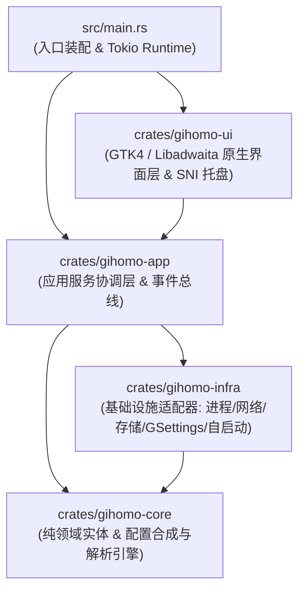

# Gihomo 系统架构设计规范 (Gihomo Architecture)

> **版本**：v1.1.0  
> **状态**：正式规范  
> **适用范围**：Gihomo 全工程模块设计、代码贡献与重构标准  

---

## 1. 系统愿景与核心设计原则

Gihomo 是专为现代 Linux 桌面（尤其是 GNOME 环境）量身定制的原生 Mihomo (Clash.Meta) 管理客户端。它旨在提供极致轻量、零虚拟化损耗、无缝桌面集成与高安全性的网络代理体验。

### 核心设计原则
1. **Clean Architecture (整洁架构)**：严格遵循领域驱动设计的分层模型，业务领域实体不依赖任何 UI 框架或外部网络驱动。
2. **Native Process Supervision (原生进程监管)**：直接基于 Tokio 异步多线程执行环境启动并监控独立的 Mihomo 静态二进制，彻底摆脱外部虚拟化容器与额外守护进程依赖。
3. **Least Privilege & Linux Capabilities (最小权限与权能模型)**：利用 Linux 文件权能（`CAP_NET_ADMIN` + `CAP_NET_BIND_SERVICE`）实现普通用户身份执行 TUN 虚拟网卡接管，杜绝直接以 root 身份运行整个 GUI 客户端。
4. **Desktop Polkit Authorization (桌面级安全策略集成)**：通过标准 FreeDesktop Polkit 规则授权 `systemd-resolved` D-Bus 接口，杜绝开关 TUN 时反复弹出密码提示框。
5. **Reactive Event Bus (响应式单向事件流)**：前端与后台通过异步无锁事件管道通信，确保界面 60FPS 丝滑流畅，无阻塞、无卡死。

---

## 2. 工作空间与模块分层架构

工程采用 Cargo 模块化工作空间架构，划分为四个职责单一的子 Crate：



### 2.1 纯领域层 (`crates/gihomo-core`)
- **定位**：整个系统的心脏，不包含任何与 GTK、Reqwest、Tokio 等具体技术绑定的逻辑。
- **职责**：
  - **核心实体定义**：
    - `Subscription`（订阅模型）、`SubscriptionSource`（订阅源类型：远程 URL、单节点分享链接离线批量导入、本地 YAML 文件）、`SubscriptionUserInfo`（流量配额）；
    - `ProxyGroup` 与 `ProxyNode`（代理策略组、节点类型与延迟）；
    - `KernelStatus`（内核运行状态）；
    - `RuleItem`（分流规则模型）与 `RuleProvider`（外部规则集模型）；
    - `GeoDatabaseInfo`（Geo 数据库文件元数据）；
    - `ConnectionItem`、`ConnectionMetadata` 与 `ConnectionsSnapshot`（活跃 TCP/UDP 连接会话与快照透视）；
    - `TrafficStats`（瞬时传输流速与累计流量统计）；
    - `TunConfig`（TUN 模式配置）。
  - **配置合成与解析引擎**：
    - `generate_base_config` 与 `merge_subscription_config`：负责将基础网络配置、TUN 规则与订阅提供的节点/分流规则无缝智能合并为合法的 Mihomo YAML 配置文件，保真保留 `sniffer`、`hosts`、`geox-url` 及自定义 DNS 策略，并强制将 `external-controller` 绑定至 `127.0.0.1` 本地回环。
    - `parse_share_link` 与 `parse_batch_share_links`：纯本地离线解析 Shadowsocks、VMess、VLESS、Trojan、Hysteria 2 等单节点分享链接，自动生成高可用 Profile。

### 2.2 基础设施适配层 (`crates/gihomo-infra`)
- **定位**：负责与外部环境（操作系统、文件系统、网络协议、外部进程）进行真实数据交互。
- **职责**：
  - **`KernelManager`**：原生内核的发现引擎（纯 Rust `std::env::split_paths` 检索系统 PATH、打包内置路径 `/usr/lib/gihomo/bin/mihomo` 及用户本地私有目录）、子进程直接托管、Linux `PR_SET_PDEATHSIG` 子进程防孤儿保护与安全退出。
  - **`MihomoApiClient`**：通过 HTTP REST API 进行配置重载、节点切换、单节点与批量延迟测速；通过 WebSocket 直连内核进行毫秒级瞬时速率采集与实时日志流推送。
  - **`SystemProxyManager`**：通过 GSettings（`org.gnome.system.proxy`）操纵 GNOME 桌面环境的系统级 HTTP/SOCKS 代理状态，并在客户端退出时统筹复位为直连模式。
  - **`StorageManager`**：负责 FreeDesktop 规范下的用户数据持久化存储（`~/.local/share/art.artforge.Gihomo/`）、ETag 与 HTTP 304 缓存更新、PID 追踪及 Geo 数据库文件管理。
  - **`AutostartManager`**：基于 FreeDesktop Autostart 规范管理桌面开机自启项（`~/.config/autostart/art.artforge.Gihomo.desktop`）。

### 2.3 应用服务协调层 (`crates/gihomo-app`)
- **定位**：系统的业务用例协调器与状态机。
- **职责**：
  - **`AppService`**：作为单例协调中枢，连接 Infrastructure 与 Core，向 UI 层暴露业务接口和 `AppError` 错误类型。
  - **`AppEvent` 事件总线**：基于 `tokio::sync::broadcast` 实现从后台异步工作线程到主界面的解耦单向事件分发；接收端需处理 lag 并重新读取关键状态。
  - **后台轮询与保活守护**：定时抓取流量流、监控内核健康状态并在异常断连时优雅降级。
  - **定时自动更新调度器**：基于预设周期（30分钟、1/2/6/12/24小时）静默执行订阅拉取、ETag 差量校验与内核热重载。

### 2.4 原生展示层 (`crates/gihomo-ui`)
- **定位**：纯声明与响应式的 GTK4 + Libadwaita 桌面用户界面与 D-Bus 系统托盘。
- **边界**：仅依赖 `gihomo-app` 和领域数据，不直接调用 `gihomo-infra`；文件系统和系统设置操作由应用服务协调。
- **职责**：
  - **导航架构与高频梯队**：基于 `AdwNavigationSplitView` 构建自适应分栏，按用户使用频次划分为三大梯队并以 1px 原生细线视觉隔离（第一梯队：仪表盘 $\to$ 节点代理 $\to$ 订阅管理；第二梯队：连接监控 $\to$ 分流规则 $\to$ 实时日志；第三梯队：应用设置）。
  - **7 大核心视图划分**：
    - `DashboardView`：系统控制总览（系统代理/TUN/分流模式/内核启停）、实时上下行速率仪表盘、活跃订阅流量看板。
    - `ProxiesView`：原生 HeaderBar 策略组选择下拉菜单 (`gtk::DropDown`)、通栏自适应操作工具栏（搜索/批量测速/刷新）、单节点专属测速图标按钮、自适应断点（`max-width: 560px`）下沉重排与原地增量更新 (In-Place Diff)。
    - `SubscriptionsView`：多订阅列表管理（远程 URL、分享链接批量导入、本地 YAML 文件）、`adw::Dialog` 自适应原生浮层、后台定时自动增量更新调度。
    - `ConnectionsView`：实时 TCP/UDP 活跃连接监控与传输流速、连接详细元数据透视（源进程/目标地址/规则链/代理节点）、防爆分批懒加载 (`CONN_PAGE_SIZE = 80`)、单连接就地断开与二次警示确认的全量连接断开。
    - `RulesView`：全局分流规则实时模糊检索（200ms 防抖）、颜色徽章分类、外部规则集（Rule Providers）状态追踪与一键手动拉取更新、分段虚拟渲染。
    - `LogsView`：内核实时日志与诊断控制台、双源无缝平滑衔接（预加载磁盘历史 `mihomo.log` 最近 200 行 + WebSocket 实时流）、3000 行环形内存防爆、规范双行顶栏（级别筛选/搜索 + 滚动锁定/复制/导出/清空）、一键导出至 `~/Downloads`。
    - `SettingsView`：内核路径管理、TUN 权能检测、开机自启与关闭至托盘配置、语言即时热切换与深浅主题切换、Geo 数据库看板与一键在线更新。
  - **系统托盘与常驻守护 (`GihomoTray`)**：基于 `ksni` 接入 Linux D-Bus StatusNotifierItem (SNI) 协议，提供一键快捷切换订阅（带 `✓` 打勾标记）、实时 Tooltip 状态展示与后台常驻守护。
  - **UI 防抖与防反馈机制**：为 Switch 与 DropDown 控件设置原子操作保护，杜绝后端状态事件与前端用户交互事件之间的死循环。
  - **i18n 子系统**：内存字典双语映射（`zh-CN` / `en-US` 100% 对称覆盖 267 个词条），支持在设置页无重启就地毫秒级热重载。

---

## 3. 安全模型与 TUN 授权设计

### 3.1 Mihomo 外部控制器
外部控制器只绑定 `127.0.0.1`，并使用应用生成的稳定随机密钥。密钥存放在 `mihomo/controller.secret` 中，目录权限为 `0700`、文件权限为 `0600`；启动内核时会强制覆盖活动配置中的 controller 地址和密钥，避免旧配置或订阅内容重新暴露控制端口。

### 3.2 为什么避免以 root 运行 GUI？
直接以 `sudo gihomo` 运行图形界面严重违反 Linux 安全规范，会导致生成的配置文件所有权变为 root，且使整个 GTK 堆栈暴露在特权上下文中。

### 3.3 两级权能与权限解决方案
Gihomo 采用 Linux 原生现代权限架构：
1. **网络级权能**：
   通过包管理器在安装后脚本（`postinst` / `%post`）中对内核二进制赋予 Linux Capabilities：
   ```bash
   setcap cap_net_admin,cap_net_bind_service=+ep /usr/lib/gihomo/bin/mihomo
   ```
   内核即可在无 root 提权的情况下创建 `gihomo` 网卡并配置 `iproute2` 路由表。

2. **D-Bus DNS 策略授权**：
   Mihomo 在 TUN 模式下需通知 `systemd-resolved` 接管 Link DNS。Gihomo 在系统中部署标准 Polkit 策略：
   `/usr/share/polkit-1/rules.d/art.artforge.Gihomo.rules`
   直接对本地活跃桌面用户授权 `org.freedesktop.resolve1.*` 动作，彻底避免开启 TUN 时的连续管理员密码弹窗。

---

## 4. 存储规范与目录结构

所有应用数据严格遵循 FreeDesktop XDG 规范：

| 路径 | 用途 |
|---|---|
| `~/.local/share/art.artforge.Gihomo/subscriptions/` | 各机场/订阅源原始 YAML 缓存 |
| `~/.local/share/art.artforge.Gihomo/subscriptions.json` | 订阅元数据集合（名称、URL、更新时间、配额） |
| `~/.local/share/art.artforge.Gihomo/mihomo/config.yaml` | 合成的当前运行时 Mihomo 主配置文件 |
| `~/.local/share/art.artforge.Gihomo/mihomo/controller.secret` | 稳定随机控制器密钥，仅用户可读写 |
| `~/.local/share/art.artforge.Gihomo/mihomo/geoip.metadb` | 本地 GeoIP 数据库缓存文件 |
| `~/.local/share/art.artforge.Gihomo/mihomo/geosite.dat` | 本地 GeoSite 数据库缓存文件 |
| `~/.local/share/art.artforge.Gihomo/bin/mihomo` | 用户自定义安装/优先查找的本地 Mihomo 内核二进制 |
| `~/.local/share/art.artforge.Gihomo/mihomo.pid` | 当前受监管内核进程的 PID 记录 |
| `~/.local/share/art.artforge.Gihomo/logs/mihomo.log` | 内核控制台标准输出与日志归档 |
| `~/.config/art.artforge.Gihomo/config.json` | 客户端偏好配置（语言、主题、关闭至托盘、自启内核、自动恢复代理、定时更新间隔） |
| `~/.config/autostart/art.artforge.Gihomo.desktop` | 桌面开机自启动配置文件 |

