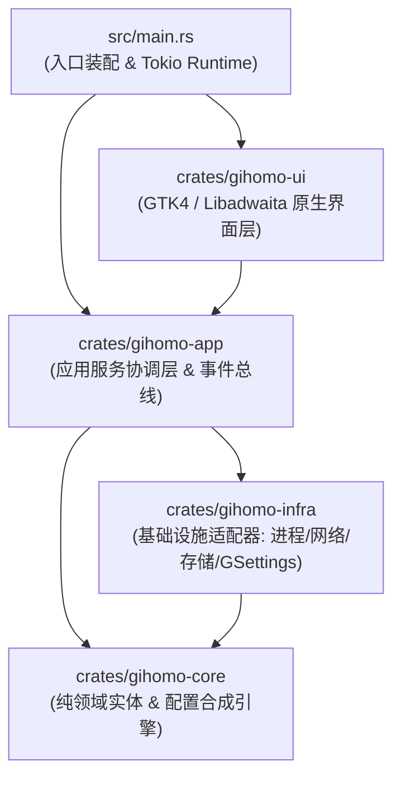

# Gihomo 系统架构设计规范 (Gihomo Architecture)

> **版本**：v0.1.0  
> **状态**：正式规范  
> **适用范围**：Gihomo 全工程模块设计、代码贡献与重构标准  

---

## 1. 系统愿景与核心设计原则

Gihomo 是专为现代 Linux 桌面（尤其是 GNOME 环境）量身定制的原生 Mihomo (Clash.Meta) 管理客户端。它旨在提供极致轻量、零虚拟化损耗、无缝桌面集成与高安全性的网络代理体验。

### 核心设计原则
1. **Clean Architecture (整洁架构)**：严格遵循领域驱动设计的分层模型，业务领域实体不依赖任何 UI 框架或外部网络驱动。
2. **Native Process Supervision (原生进程监管)**：直接基于 Tokio 异步多线程执行环境启动并监控独立的 Mihomo 静态二进制，彻底摆脱外部虚拟化容器与额外守护进程依赖。
3. **Least Privilege & Linux Capabilities (最小权限与权能模型)**：利用 Linux 文件权能（`CAP_NET_ADMIN` + `CAP_NET_BIND_SERVICE`）实现普通用户身份执行 TUN 虚拟网卡接管，杜绝直接以 root 身份运行整个 GUI 客户端。
4. **Desktop Polkit Authorization (桌面级安全策略集成)**：通过标准 FreeDesktop Polkit 规则授权 `systemd-resolved` D-Bus 接口，杜绝开关 TUN 时反复弹出密码提示框。
5. **Reactive Event Bus (响应式单向事件流)**：前端与后台通过异步无锁事件管道通信，确保界面 60FPS 丝滑流畅，无阻塞、无卡死。

---

## 2. 工作空间与模块分层架构

工程采用 Cargo 模块化工作空间架构，划分为四个职责单一的子 Crate：



### 2.1 纯领域层 (`crates/gihomo-core`)
- **定位**：整个系统的心脏，不包含任何与 GTK、Reqwest、Tokio 等具体技术绑定的逻辑。
- **职责**：
  - 核心实体定义：`Subscription`（订阅模型）、`SubscriptionUserInfo`（流量配额）、`ProxyGroup`（策略组）、`KernelStatus`（内核运行状态）。
  - 配置合成引擎：`generate_base_config` 与 `merge_subscription_config`，负责将基础网络配置、TUN 规则与订阅提供的节点/分流规则无缝智能合并为合法的 Mihomo YAML 配置文件。

### 2.2 基础设施适配层 (`crates/gihomo-infra`)
- **定位**：负责与外部环境（操作系统、文件系统、网络协议、外部进程）进行真实数据交互。
- **职责**：
  - **`KernelManager`**：原生内核的发现引擎（多级路径查找）、子进程启动、状态探测与安全终止。
  - **`MihomoApiClient`**：通过 HTTP REST API 进行配置重载、节点切换、延迟测速，并通过 WebSocket 直连内核进行毫秒级流量遥测。
  - **`GnomeProxyManager`**：通过 GSettings（`org.gnome.system.proxy`）操纵 GNOME 桌面环境的系统级代理状态。
  - **`StorageManager`**：负责 FreeDesktop 规范下的用户数据持久化存储（`~/.local/share/art.artforge.Gihomo/`）。

### 2.3 应用服务协调层 (`crates/gihomo-app`)
- **定位**：系统的业务用例协调器与状态机。
- **职责**：
  - **`AppService`**：作为单例协调中枢，连接 Infrastructure 与 Core，向 UI 层暴露业务接口和 `AppError` 错误类型。
  - **`AppEvent` 事件总线**：基于 `tokio::sync::broadcast` 实现从后台异步工作线程到主界面的解耦单向事件分发；接收端需处理 lag 并重新读取关键状态。
  - **后台轮询与保活守护**：定时抓取流量流、监控内核健康状态并在异常断连时优雅降级。

### 2.4 原生展示层 (`crates/gihomo-ui`)
- **定位**：纯声明与响应式的 GTK4 + Libadwaita 桌面用户界面。
- **边界**：仅依赖 `gihomo-app` 和领域数据，不直接调用 `gihomo-infra`；文件系统和系统设置操作由应用服务协调。
- **职责**：
  - **视图划分**：
    - `DashboardView`：系统控制总览、实时上下行速率仪表盘、活跃订阅流量看板。
    - `ProxiesView`：策略组 Tab 分页、节点延迟批量测速气泡、活跃节点高亮与点击切换。
    - `SubscriptionsView`：多订阅列表管理、远程链接添加/编辑/更新/删除。
    - `SettingsView`：内核路径管理、TUN 权能检测、语言即时切换与深浅主题切换。
  - **UI 防抖与防反馈机制**：为 Switch 控件设置原子操作保护，杜绝后端状态事件与前端用户交互事件之间的死循环。
  - **i18n 子系统**：内存字典映射，支持偏好设置对话框中的无重启热重载。

---

## 3. 安全模型与 TUN 授权设计

### 3.1 Mihomo 外部控制器
外部控制器只绑定 `127.0.0.1`，并使用应用生成的稳定随机密钥。密钥存放在 `mihomo/controller.secret` 中，目录权限为 `0700`、文件权限为 `0600`；启动内核时会强制覆盖活动配置中的 controller 地址和密钥，避免旧配置或订阅内容重新暴露控制端口。

### 3.2 为什么避免以 root 运行 GUI？
直接以 `sudo gihomo` 运行图形界面严重违反 Linux 安全规范，会导致生成的配置文件所有权变为 root，且使整个 GTK 堆栈暴露在特权上下文中。

### 3.3 两级权能与权限解决方案
Gihomo 采用 Linux 原生现代权限架构：
1. **网络级权能**：
   通过包管理器在安装后脚本（`postinst` / `%post`）中对内核二进制赋予 Linux Capabilities：
   ```bash
   setcap cap_net_admin,cap_net_bind_service=+ep /usr/lib/gihomo/bin/mihomo
   ```
   内核即可在无 root 提权的情况下创建 `gihomo` 网卡并配置 `iproute2` 路由表。

2. **D-Bus DNS 策略授权**：
   Mihomo 在 TUN 模式下需通知 `systemd-resolved` 接管 Link DNS。Gihomo 在系统中部署标准 Polkit 策略：
   `/usr/share/polkit-1/rules.d/art.artforge.Gihomo.rules`
   直接对本地活跃桌面用户授权 `org.freedesktop.resolve1.*` 动作，彻底避免开启 TUN 时的连续管理员密码弹窗。

---

## 4. 存储规范与目录结构

所有应用数据严格遵循 FreeDesktop XDG 规范：

| 路径 | 用途 |
|---|---|
| `~/.local/share/art.artforge.Gihomo/subscriptions/` | 各机场/订阅源原始 YAML 缓存 |
| `~/.local/share/art.artforge.Gihomo/subscriptions.json` | 订阅元数据集合（名称、URL、更新时间、配额） |
| `~/.local/share/art.artforge.Gihomo/mihomo/config.yaml` | 合成的当前运行时 Mihomo 主配置文件 |
| `~/.local/share/art.artforge.Gihomo/mihomo/controller.secret` | 稳定随机控制器密钥，仅用户可读写 |
| `~/.local/share/art.artforge.Gihomo/mihomo.pid` | 当前受监管内核进程的 PID 记录 |
| `~/.local/share/art.artforge.Gihomo/logs/mihomo.log` | 内核控制台标准输出与日志归档 |
| `~/.config/art.artforge.Gihomo/config.json` | 客户端 UI 偏好配置（语言、主题模式） |
